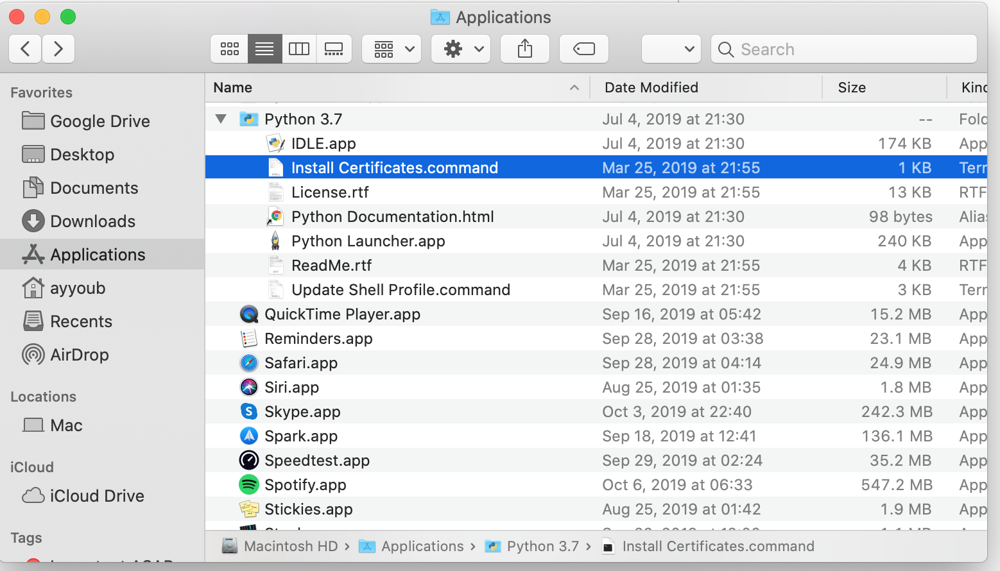

<h1 align="center">Face Mask Detection</h1>

<div align= "center">
  <h4>Face Mask Detection System built with OpenCV, Keras/TensorFlow using Deep Learning and Computer Vision concepts in order to detect face masks in static images </h4>
</div>

## 🚀&nbsp; Pre-requisites
1. Macbook Pro recommended or Windows with atleast Intel i5 CPU, 8GB RAM and 256 GB SSD
2. Install Python 3.7.6 or above
3. Keep Homebrew updated if using MacBook

## 🚀&nbsp; Installation
1. Clone the repo
```
$ git clone https://github.com/Pavivenkatesan/FaceMaskDetection.git
```

2. Change your directory to the cloned repo 
```
$ cd FaceMaskDetection
```

3. Create a Python virtual environment named 'test' and activate it
```
$ virtualenv test
```
```
$ source test/bin/activate
```

4. Now, run the following command in your Terminal/Command Prompt to install the libraries required
```
$ pip3 install -r requirements.txt
```


## :bulb: Working

Open terminal. Go into the cloned project directory and type the following command:
```
$ python3 train_mask_detector.py --dataset dataset
```

## Common error situations
Tensorflow errors
```
$pip3 install tensorflow==2.8.0 --ignore-installed
```
Scipy Errors

```
$pip3 install -U scikit-learn scipy matplotlib
```

IM Utils error

```
$pip3 install --upgrade imutils
```

OpenCV Python
```
$pip3 install opencv-python
```

Certificate Error

```
urllib.error.URLError: <urlopen error [SSL: CERTIFICATE_VERIFY_FAILED] certificate verify failed: unable to get local issuer certificate (_ssl.c:1076)>

During handling of the above exception, another exception occurred:
```

For anyone who still wonders on how to fix this, i got mine by installing the "Install Certificates.command"
Here is how I did,

Double Click `Install Certificates.command` under Python 3.7 folder in Applications


2. To detect face masks in an image type the following command: 
```
$ python3 detect_mask_image.py --image images/pic1.jpeg
```

## :key: Results

#### The model gave 98% accuracy for Face Mask Detection after training via <code>tensorflow-gpu==2.8.0</code>

## :eyes: License
MIT © [Pavithra Venkatesan](https://github.com/PaviVenkatesan/FaceMaskDetection/blob/master/LICENSE)

